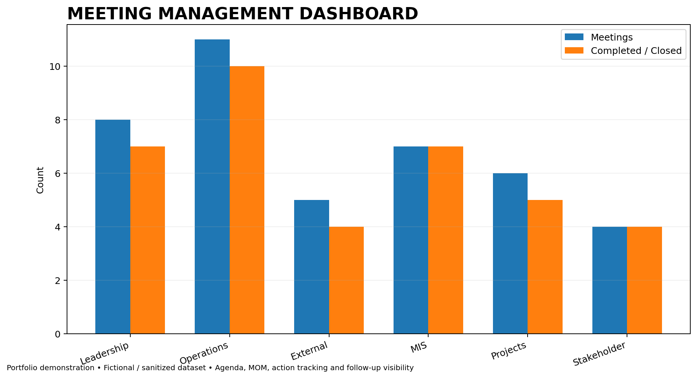

# Executive Meeting Management

### Kiran Kumar Ambati

**Senior Executive Assistant | Executive Office | C-Suite Support | Meeting Management**

> A professional portfolio demonstrating structured meeting planning, agenda management, meeting coordination, Minutes of Meeting (MOM), action tracking, stakeholder follow-up and meeting effectiveness.

---

## 🎯 Executive Meeting Management

Effective executive meeting management is more than scheduling a meeting. It requires structured planning, clear objectives, stakeholder coordination, accurate documentation and disciplined follow-through.

This portfolio demonstrates a structured approach to managing executive and leadership meetings from initial request through action closure.

### Meeting Management Lifecycle

**Request → Plan → Coordinate → Execute → Document → Follow Up → Close**

---

## 📌 Core Responsibilities

| Area | Approach |
|---|---|
| 📅 Meeting Planning | Define objectives, participants, agenda and timelines |
| 🎯 Agenda Management | Structure discussion topics around business priorities |
| 🤝 Stakeholder Coordination | Coordinate executives, internal teams and external stakeholders |
| ⏰ Scheduling | Identify suitable time slots and manage calendar constraints |
| 📋 Meeting Preparation | Ensure agendas, presentations, documents and meeting links are ready |
| 📝 Minutes of Meeting | Capture key decisions, discussions and action items |
| ✅ Action Tracking | Assign owners, deadlines and follow-up requirements |
| 🔄 Follow-Up | Track outstanding actions and communicate status updates |
| 📊 Reporting | Monitor meeting activity, action closure and effectiveness |
| 🔐 Confidentiality | Maintain discretion while handling executive information |

---

## 🧠 Meeting Operating Model

### 1. Request

Capture the meeting requirement, objective, stakeholders and expected outcome.

### 2. Plan

Define the agenda, participants, priority topics, duration and required preparation.

### 3. Coordinate

Manage calendars, meeting rooms, virtual links, documents and stakeholder availability.

### 4. Execute

Ensure the meeting starts with the required information and remains focused on the intended objectives.

### 5. Document

Capture Minutes of Meeting (MOM), key decisions, action items, owners and deadlines.

### 6. Follow Up

Track outstanding actions, communicate reminders and provide status visibility to leadership.

### 7. Close

Confirm completion of actions and maintain appropriate records for future reference.

---

## 📊 Meeting Management Dashboard

The dashboard provides a visual portfolio demonstration of meeting activity and effectiveness.



### Dashboard Focus

- Meeting volume and activity
- Meeting completion
- Action-item tracking
- Action closure
- Meeting effectiveness
- Stakeholder follow-up
- Executive meeting visibility

> **Portfolio demonstration:** Dashboard information is based on fictional/sanitized portfolio data and does not represent confidential organizational information.

---

## 📝 Action Tracker

The project includes an action tracker designed to provide visibility into post-meeting commitments.

### Action Tracking Framework

| Field | Purpose |
|---|---|
| Action Item | Clearly define the required activity |
| Owner | Identify the responsible stakeholder |
| Priority | Classify business importance |
| Due Date | Establish expected completion date |
| Status | Monitor progress |
| Follow-Up | Record reminder or escalation requirement |
| Closure | Confirm completion |

The tracker supports a simple operating principle:

**Assign → Track → Follow Up → Escalate → Close**

---

## 📈 Meeting Effectiveness

Meeting effectiveness can be improved by monitoring:

- Agenda adherence
- Meeting duration
- Decision clarity
- Action ownership
- Action closure
- Follow-up discipline
- Stakeholder participation
- Recurring meeting requirements

The objective is to ensure that meetings result in **clear decisions, accountable actions and measurable follow-through**.

---

## 💼 Executive Support Value

This portfolio demonstrates the ability to:

- Support senior leadership and C-Suite executives
- Manage complex executive meetings
- Coordinate multiple stakeholders
- Prepare structured meeting agendas
- Maintain accurate MOM and action records
- Track deadlines and commitments
- Proactively manage follow-ups
- Provide management visibility through reporting
- Handle sensitive executive information with discretion
- Improve operational discipline around meetings

---

## 🛠️ Tools & Working Methods

**Microsoft Excel | Microsoft Outlook | Microsoft Teams | PowerPoint | Calendar Management | MIS Reporting | Action Tracking | MOM | Dashboard Reporting | Stakeholder Coordination**

---

## 🔄 Executive Meeting Workflow

```text
Meeting Request
      ↓
Define Objective
      ↓
Identify Stakeholders
      ↓
Prepare Agenda
      ↓
Schedule & Coordinate
      ↓
Conduct Meeting
      ↓
Prepare MOM
      ↓
Assign Actions
      ↓
Track Progress
      ↓
Follow Up
      ↓
Close Actions
